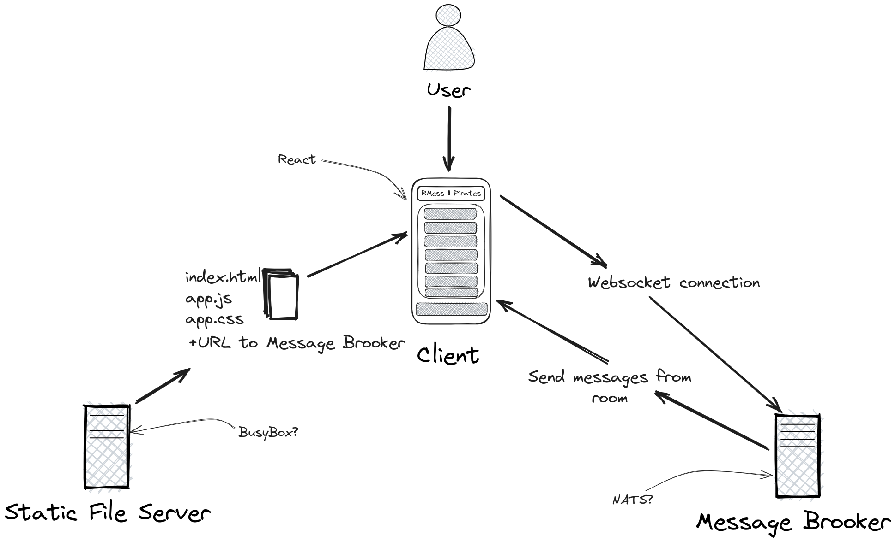

# R Mess

## Content

- [About](#about)
- [Goal](#goal)
- [References](#references)

## About

R Mess aims to be a realtime messaging application learning experience.

## Architecture



- Static File Server
  Delivers the Application files to the client, along with brooker adress
- Application
  Frontend application for interacting with the chat room and connecting to the...
- Message Brooker
  Responsible for accepting new subscriptions and publishing messages to subscribers

## Goal

- Frontend
  - Chat Client
    - Creating and/or entering rooms
    - Publishing and listening for messages in a room
  - Framework [React](https://react.dev/)

- Backend
  - Message Brooker
    - Enables clients to subscribe to rooms, publish messages and recive messages from other online clients
    - ?? Persistance ??
  - Framework [Nats](https://nats.io/)

## How to run

1. Ensure you have some way to run Docker Compose files
  - Windows
    - [Docker Desktop](https://www.docker.com/products/docker-desktop/)
  - iOS
    - [OrbStack](https://orbstack.dev/)
    - [Docker Desktop](https://www.docker.com/products/docker-desktop/)
  - Linux
    - [Docker Engine](https://docs.docker.com/engine/install/ubuntu/)
    - [Docker Desktop](https://www.docker.com/products/docker-desktop/)

2. From the project root folder run ```$ docker compose up```

3. Open up open your browser and navigate to **http://localhost:5000**

## References

- [Publication Subscription Pattern](https://en.wikipedia.org/wiki/Publish%E2%80%93subscribe_pattern)
- [Connection Websockets](https://en.wikipedia.org/wiki/WebSocket)
- [Containers (Docker)](https://www.docker.com/resources/what-container/)
- [Lightweight Orchestration (Docker Compose)](https://docs.docker.com/compose/)

### Languages

  - [JavaScript](https://www.ecma-international.org/publications-and-standards/standards/ecma-262/)
  - [Go](https://go.dev/)
